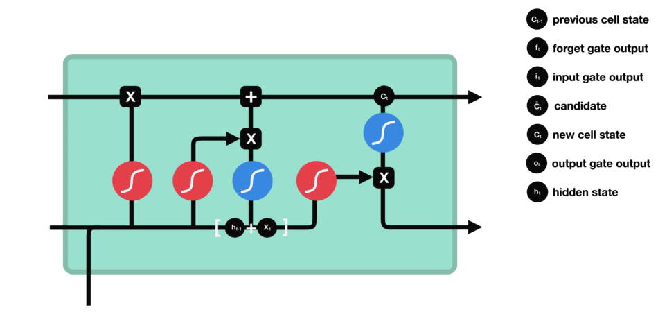
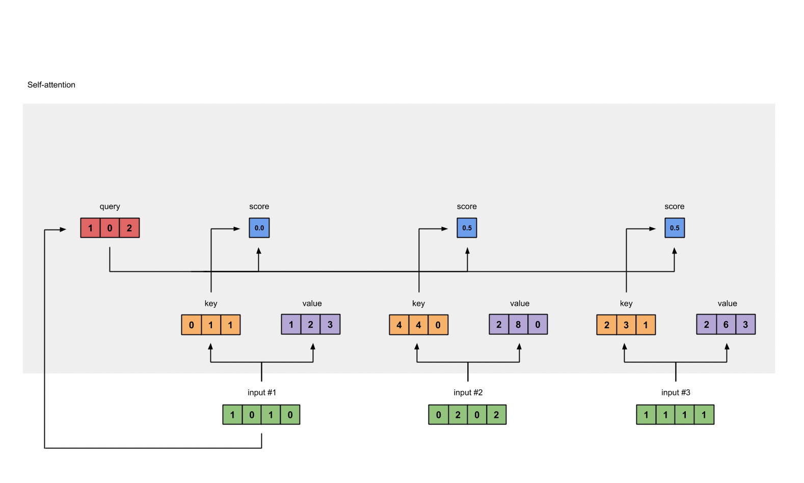
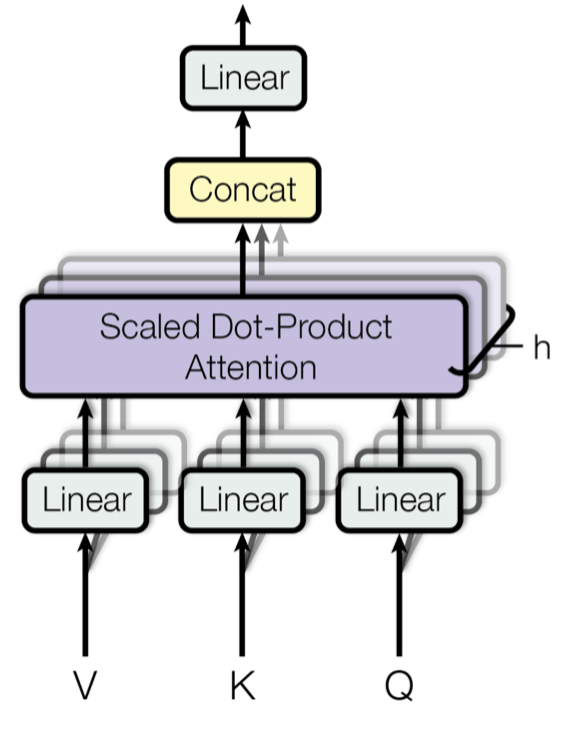

# nlp-notes
Overview of Natural Language Processing (NLP) neural network models

*All of the excellent figures (and some of the wording) are taken from the following references*:
- https://towardsdatascience.com/illustrated-guide-to-lstms-and-gru-s-a-step-by-step-explanation-44e9eb85bf21
- http://jalammar.github.io/illustrated-bert/
- http://colah.github.io/posts/2015-09-NN-Types-FP/
- https://www.researchgate.net/publication/327645964_Unsupervised_Suicide_Note_Classification
- https://blog.floydhub.com/attention-mechanism/
- https://towardsdatascience.com/illustrated-self-attention-2d627e33b20a
- https://arxiv.org/pdf/1601.06733.pdf
- http://papers.nips.cc/paper/7181-attention-is-all-you-need.pdf

### Recurrent Neural Network (RNN)
The RNN is designed to be the simplest implementation of a neural network architecture for interpreting sequence and time-series data. As each token (word, nucleic acid, amino acid...) is read, the token (input) is concatenated with a context vector (previous hidden state), and interpreted by the neural network with a Tanh activation function:

The updated context vector (new hidden state) becomes the previous hidden state for interpreting the next token:

After interpreting the full sequence of tokens, the final context vector (final hidden state) represents the neural networks understanding of the sequence.

### Long Short-Term Memory (LSTM)
One of the major drawbacks with the RNN is it suffers from long-term memory loss (the context vector will quickly lose memory of tokens it saw a long time ago). We can remedy this by explicitly giving the neural network control over which memories to keep and which to forget. The input and previous hidden state are concatenated as before, but they are first passed through a *forget gate* with a sigmoid output between 0 (forget it) and 1 (remember it):

Next, the *input gate* decides what content from the hidden state to store in long-term memory with parallel sigmoid and Tanh activations (outputs between 0 to 1, and -1 to 1, respectively):

Now we can calculate our long-term memory storage *cell state* by multiplying the forget gate and adding the input gate:

Finally, the *output gate* combines the learned long-term memory with the hidden state to give our new hidden state:

### Gated Recurrent Unit (GRU)
The LSTM is a thorough, yet complex way to store long-term memory. This model can be simplified without sacrificing much in performance. The GRU removes the cell state, and only contains two gates:
- Update gate: Replaces the forget and input gates of an LSTM, deciding what information to remember and what to throw away
- Reset gate: Another gate to decide how much past information to forget

### Bidirectional LSTM (BiLSTM)
Why should a machine be restricted to reading a sequence in one direction? In many cases (gene and protein sequences included) a great deal of information about a token is lost without combining information from the left and right sides:

### Attention Mechanism
While LSTMs and GRUs are resistant to long-term memory loss, they are far from perfect and fail to retain connections between distant tokens in long sequences. Attention solves this problem by creating connections between tokens without any distance dependence. The context vector is calculated as a weighted sum of all hiddens states followed by softmax activation, as opposed to simply assigning a hidden state as the context vector:

How the hidden states are weighted depends upon the specific application:
- Sequence-to-sequence model: A sequence is passed through an encoder, and the final hidden state is passed through a decoder for translation. The attention weights are a function of [1] the previous decoder hidden state and [2] each of the encoder hidden states. This allows sequence-to-sequence models to focus on the most relevant token(s) from the untranslated sequence at each step of the decoding (translation) process:
  
  
  
- Self attention model: The attention model can also create distant connections between tokens within the same sequence, thus eliminating the long-term memory loss problems of the LSTM/GRU models altogether. First, *key*, *value*, and *query* vectors are computed from the inputs:
  
  
  
  Starting with the first input, its *query* is used to calculate attention scores from the *keys*, which are multiplied with the *values* :
  
  

  Summing the weighted results produces the output for the first input:
  
  

  And this process is continued for the remaining inputs...

### Long Short-Term Memory Network (LSTMN)
The LSTM was combined with self attention, connecting distant past tokens to the current decision process. The current word is in red and the size of the blue shade indicates the activation level:

### Transformers
Transformers marked an inflection point with the realization that NLP models could be driven entirely by the self attention mechanism without any recurrent architecture (RNN/LSTM/GRU). The key was to implement a multi-head self attention mechanism, where multiple key-value pair encodings are learned for each input. Free from the sequential nature of traditional recurrent neural networks, learning could be highly parallelized for faster training of deeper models:

Transformers comprise an encoder-decoder architecture:
- Encoder: Six identical layers are stacked. Each layer comprises a multi-head self attention layer and a feed-forward network, both utilizing residual connections and normalization:
  
  

- Decoder: Six identical layers are stacked. Each layer comprises two multi-head self attention layers and a feed-forward network, all utilizing residual connections and normalization. The first multi-head self attention layer takes the previous outputs of the decoder as its input, and the second multi-head self attention layer takes the embedder output as input. The results are combined and passed through a feed-forward network:
  
  

The overall Transformer encoder-decoder architecture:

## Embedding
Embedding is the process of converting a token into a fixed length numerical vector. Nearly all NLP tasks can be broken down into a two-step process of [1] token embedding (TOKENIZATION?) with an unsupervised NLP model pre-trained on a database of sequences, and [2] supervised learning to complete the task at hand. The quality of the embedder is a critical component of how well the task can be learned.

### Word2Vec and GloVe
The NLP community quickly realized it was better to pre-train embeddings with unsupervised learning on large text databases, as opposed to learning them on the fly during a supervised learning task on what was frequently a small dataset. By training unsupervised models on a large corpus of text, models such as Word2Vec and GloVe learned useful word embeddings for a variety of NLP tasks.

### ELMo
Word2Vec and GloVe learn fixed numerical embeddings for words. The shortcoming of this approach is that the numerical embedding for a token should depend on the context! For example, the word "bass" should have very different embeddings for the sentences "I caught a bass" and "turn up the bass".

ELMo is an unsupervised multi-layered LSTM trained to predict the next token in a sequence:

ELMo does this in both directions in order to capture context from the full sequence in its embedding, making it a bi-directional LSTM:

The hidden layers from the forward and backward passes are concatenated, and are suitably aggregated for the NLP task at hand:

